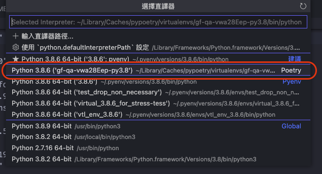
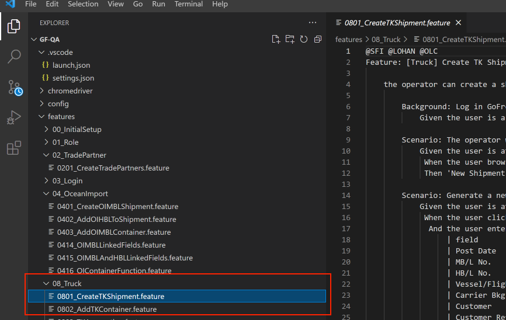
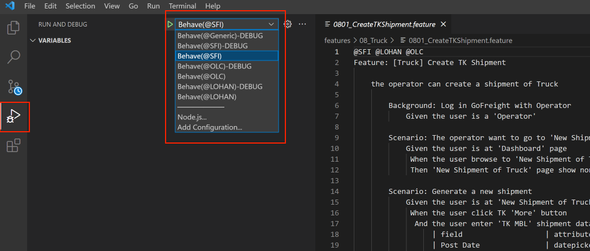

# GF_Web_Automation

<pre>
                         _____         ______             _           _       _
                        / ____|       |  ____|           (_)         | |     | |
                       | |  __   ___  | |__  _ __   ___   _    __ _  | |__   | |_
                       | | |_ | / _ \ |  __|| '__| / _ \ | | /  _  ` | '_ \  | __|
                       | |__| || (_) || |   | |   |  __/ | | | (_| | | | | | | |_
                        \_____| \___/ |_|   |_|    \___  |_|  \__, | |_| |_|  \__|
                                                               __/ |
                                                              |___/
                                                                            |\      _,,,---,,_
                                                                    ZZZzz   /,`.-'`'    -.  ;-;;,_
                                                                           |,4-  ) )-,_. ,\ (  `'-'
                                                                          '---''(_/--'  `-'\_)

</pre>
> BDD (Behavior Driven Development) 是一種開發方式，從使用者的角度出發，以使用情境和步驟撰寫test case。

> Gherkin 是一種以BDD為基礎的"格式規範"，使用Feature, Scenario, Given, When, Then等keyword來定義test case的步驟。。

> Cucumber 是一個實作Gherkin語法的library，它支援多種程式語言(C++, Java, Python...)，且每個library的名稱皆異，其中，支援Python的library為Behave。


## 1. Setup environment
1. Install **python 3.10.2** and add path in environment variable
   
2. Install **Chrome**

3. Run cmd in project directory
   ```
   $ pip install poetry
   ```
   
   ```
   $ poetry install --no-dev
   ```

## 2. Usage
#### Run cmd in project directory
```
$ behave "{feature file path}" -D company={company} --tags={tags}
```

###### Example.
```
$ behave .\features\03_OceanImport\0301_CreateOI_m_basic.feature -D log_level=debug -D company=LOHAN -D monitor=1 --tags=LOHAN --no-logcapture --no-capture --no-skipped
```

##### if you want to execute multiple testcases once, just add feature file path after the first feature
```
$ behave "{first feature}" "{second feature}" "{third feature}"
```

```
--no-logcapture               log msg will be printed
--no-capture                  stdout output will be printed
--no-skipped                  skipped test case would not show in CLI
-D company                    instead of 'company' variable in globalparameter.py
-D log_level={level}          setting log level (level: debug, info, warning, error)
-D monitor={option}           setting monitor (0:no show, 1:main window)
-i, --include feature_name    execute specific feature(only execute the feature which match part of the given name)
--tags={tag}                  execute scenario which contains specific tag
```

#### generate allure result
&nbsp;&nbsp;add the option `-f allure -o .\allure-results`, then allure result would be generated in 'allure-results' folder (but the CLI information will not show)
> if you want to see allure report, use `allure serve .\allure-results`, the allrue result would be transfer to report and show in browser.

###### more infomation about behave cmd-line arguments? please see https://behave.readthedocs.io/en/stable/behave.html


## 3. Setup the Development Environment

1. Install **Python 3.10.2**
   1. Install Homebrew
   2. Install Pyenv
2. Install **VS Code**: https://code.visualstudio.com/
3. Install **git**, setup `git config` and `ssh key`: https://sourabhbajaj.com/mac-setup/Git/README.html
4. Download this repository:
   ```
   $ git clone https://github.com/hardcoretech/gf-qa.git
   ```

5. Setup environment
   Setup virtual environment and install required packages <br>
   ```
   $ pip install poetry
   ```
   ```
   $ poetry install
   ```
   (for M1 chip user, run `brew install openblas` and `export OPENBLAS="$(brew --prefix openblas)"` beforehand)<br>

   more infomation about python venv: https://docs.python.org/zh-tw/3/tutorial/venv.html

6. Setup pre-commit hook

   ```
   $ pre-commit install
   ```
   
   ```
   $ pre-commit install --hook-type commit-msg
   ```

7. Use VS Code to open the project folder

8. Install VS Code Extensions
    - list in `.vscode\extensions.json`
  
9.  Excute a BDD test case for testing
   1. Choose the python environment in the VS Code to the poetry's virtual environment.

   <br><br>
   
   1. Open one of `.feature` file (you can use `features/08_Truck/0801_CreateTKShipment.feature` for test)

   <br><br>

   1. open `config\company_config.yml`, fill in testing server `url` for SFI 

   2. select `Behave(@SFI)`, click 'Run and Debug' on left tool-bar, and click green arrow to start.

   <br><br>

## 5. Document
### BDD
1. https://www.qa-knowhow.com/?p=2172
2. https://dotblogs.com.tw/hatelove/2013/01/08/learning-tdd-in-30-days-day23-bdd-introduction
### Gherkin and Cucumber
1. https://hackmd.io/@onejar99/BJ9LkkBNH
2. https://www.itread01.com/content/1544337666.html
3. https://www.cnblogs.com/dami520/p/3168864.html
### Others
1. how to use cucumber tags: https://blog.csdn.net/chengly0129/article/details/79235222

## 6. TroubleShooting
### 1. Feature:
   (1) examples value can not use ',space'(逗號+空白鍵) to split value, it consider to be two values in different column.
### 2. Known Issue:
   (1) known issues to be solved by RD team, so that we can write more tests (Please see the attached [gsheet](https://docs.google.com/spreadsheets/d/1-zUBnlw0uBEstfLjOfTj7yYZ2-uf6a-of-D8UokHRqA/edit?usp=sharing)).
